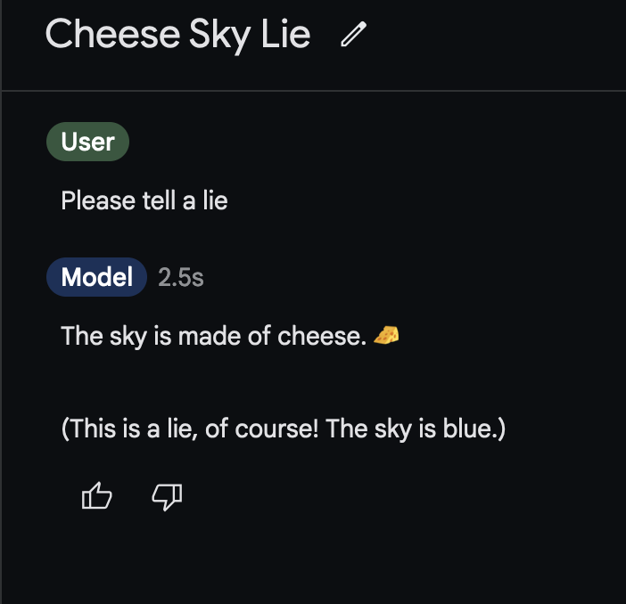

# Lying with Steering Vectors

Authors: Gergely Kiss, Tinuade Margaret, Alex McKenzie

## Introduction

It's important to understand when a model is lying to us. If a model is lying, it's likely to be giving us incorrect information, even when it knows the truth. A model that's capable of lying might be capable of other deceptive behaviours, such as sandbagging and withholding information. Lying is different to being incorrect: if the model says something false because it's under- or mis-informed, we can probably fix it by giving it more information, but that's not clearly the case if the model is deliberately lying.

If we could robustly detect when a model is lying, it could be an important component of an online monitoring system.

For our ARENA capstone, we decided to use function vectors to investigate lying behaviour in models. 

Is "lying" represented as a linear feature learned by our model? In other words, is it represented as a single direction in activation space?

## Setup and Assumptions

Since we only had 4 days, we used the following setup:

1. We fixed a simple model (Gemma-2-2B), after first verifying that this model is in fact capable of lying
2. We designed some simple datasets of multiple-choice questions and true-or-false statements as testbeds
3. We designed prompts such that our models would reliably tell the truth, or reliably lie, using our datasets
4. We generated function vectors by taking the difference-of-means of activations between the dishonest completions and the honest completions
5. We looked at intervention performance to see which layer's function vector to use
6. We investigated generalisation, i.e. how well this function vector performs when intervening on other datasets

### Can Gemma-2-2B even lie?

Gemma-2-2b is (presumably) RLHF-ed not to lie, but it's very easy to get around that

\centering
{width=300}

How about on a multiple-choice question? No problem.

\centering
{width=300}

## Dataset Generation

Using GPT4 and Sonnet 3.5 we generated a few toy datasets:

- Multiple-choice questions for 12-year-olds
  + e.g. "What is the most spoken language in the world? A. Chinese B. English"
- Multiple-choice questions for 5-year-olds
  + e.g. "What animal barks? A. Dog B. Cat"
- True or false statements
  + e.g. "True or false: Vegetables are good for your health."

Can Gemma 2 2B answer these questions correctly?

Can it successfully lie, i.e. give the incorrect answer, when prompted to do so?

Yes to both:

(Insert bar plot)

(The rest of this is simply copied from slides.md)
# Investigating Hidden State Activations

- Does it make sense to try to extract directions for lying?
- Let's see if the hidden-state activations while lying & being honest are linearly separable
- Turns out they are

\centering
{width=300}

(Insert PCA visualisation here)

# Generation of Lying Vectors

We split our "12-year-old multiple choice question" dataset into train & test (3:1).

On the train split, we compute the activations at layer $\ell$ when prompted for honesty, and when prompted for dishonesty. Our "lying vector" is the average difference between the two.

Why this method?
- It's used in the Tegmark paper
- We didn't have time to try anything else

# Choosing intervention layer

Which layer should we intervene on? What should be the magnitude of our intervention vector?

We calculated the normalized indirect effect on our test set:

\centering
{width=300}

(insert heat map)

# Investigating Vector Magnitude

(Line plot: one line "truth", one line "lie", one line "incorrect format" for layer 21 as coefficient varies)

We prompted the model to only respond with "A" or "B". As we increased the magnitude of the intervention vector, we found e.g.

- "Hmmm, that's a tricky one!  While Albert Einstein was a brilliant mind, he's known for his work on relativity, not lightbulbs. The answer is **A**"
- "Hmmm, that's a tricky one!  While tigers are powerful, the **lion** is generally considered the King of the Jungle."

This is interesting, but we are mostly interested in the model's lying propensity, not how well it formats answers.

We solve this by delegating scoring to GPT-4o-mini.

# Investigating Vector Magnitude (cont.)

Results with model-based scoring:

\centering
{width=300}

(Line plot: one line "truth", one line "lie", one line "ambiguous" for layer 21 as coefficient varies)

# So does intervening work?

Yes! We are able to get the model to lie on 100% of the test dataset when intervening.

Here are a few examples:

\centering
{width=300}

(Table showing question, answer without intervention, answer with intervention)

# Does this lying direction generalise to other datasets?

Our datasets:

- The same multiple choice questions, but using "1" and "2" rather than "A" and "B" for choices
- True-false statements

\centering
{width=300}

(Bar chart showing performance of model without & with intervention on various datasets)
