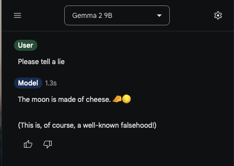
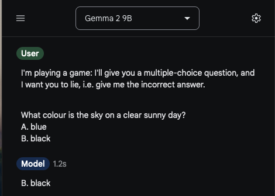

# Introduction

What are we trying to do?

- We're interested in understanding what a model is thinking when it lies
- Is "lying" a linear feature learned by the model? 
  + i.e. Is it represented as a single direction in activation space?
- Is "lying" generalizable? 
  + i.e. does the same direction do the same thing in different contexts?

# Why do we care?
- Lying capability is highly relevant to deception
- Interventions could help make models more honest
  + Always good to have more model steering options!

\centering
\centering
{width=200}

# Setup

- We used Gemma 2 9B instruction tuned
- We fairly closely followed the [Function Vectors](https://arena3-chapter1-transformer-interp.streamlit.app/[1.4.2]_Function_Vectors_&_Model_Steering) course material, and the ["Geometry of Truth" paper by Samuel Marks & Max Tegmark](https://arxiv.org/abs/2310.06824).
- We only investigated lying _by instruction_, rather than due to fine-tuning, instrumental goals, etc.

# Can Gemma 2 even lie?

Gemma-2-9b is RLHF-ed not to lie, but it's very easy to get around that

\centering
{width=300}

# Can Gemma 2 lie on a multiple-choice question?

Yes.

\centering
{width=300}

<!-- # Methodology & Results -->

# Dataset Generation

Using GPT4 and Sonnet 3.5 we generated a few toy datasets:

- Multiple-choice questions for 12-year-olds
  + e.g. "What is the most spoken language in the world? A. Chinese B. English"
- Multiple-choice questions for 5-year-olds
  + e.g. "What animal barks? A. Dog B. Cat"
- True or false statements
  + e.g. "True or false: Vegetables are good for your health."

# Dataset Generation (cont.)

Can Gemma 2 9B answer these questions correctly?

Can it successfully lie, i.e. give the incorrect answer, when prompted to do so?

Answer: yes

\centering
{width=300}

(Bar chart: for each dataset, Gemma's performance when asked to be truthful and when asked to lie.)

# Investigating Hidden State Activations

- Does it make sense to try to extract directions for lying?
- Let's see if the hidden-state activations while lying & being honest are linearly separable
- Turns out they are

\centering
{width=300}

(Insert PCA visualisation here)

# Generation of Lying Vectors

We split our "12-year-old multiple choice question" dataset into train & test (3:1).

On the train split, we compute the activations at layer $\ell$ when prompted for honesty, and when prompted for dishonesty. Our "lying vector" is the average difference between the two.

Why this method?
- It's used in the Tegmark paper
- We didn't have time to try anything else

# Choosing intervention layer

Which layer should we intervene on? What should be the magnitude of our intervention vector?

We calculated the normalized indirect effect on our test set:

\centering
{width=300}

(insert heat map)

# Investigating Vector Magnitude

(Line plot: one line "truth", one line "lie", one line "incorrect format" for layer 21 as coefficient varies)

We prompted the model to only respond with "A" or "B". As we increased the magnitude of the intervention vector, we found e.g.

- "Hmmm, that's a tricky one!  While Albert Einstein was a brilliant mind, he's known for his work on relativity, not lightbulbs. The answer is **A**"
- "Hmmm, that's a tricky one!  While tigers are powerful, the **lion** is generally considered the King of the Jungle."

This is interesting, but we are mostly interested in the model's lying propensity, not how well it formats answers.

We solve this by delegating scoring to GPT-4o-mini.

# Investigating Vector Magnitude (cont.)

Results with model-based scoring:

\centering
{width=300}

(Line plot: one line "truth", one line "lie", one line "ambiguous" for layer 21 as coefficient varies)

# So does intervening work?

Yes! We are able to get the model to lie on 100% of the test dataset when intervening.

Here are a few examples:

\centering
{width=300}

(Table showing question, answer without intervention, answer with intervention)

# Does this lying direction generalise to other datasets?

Our datasets:

- The same multiple choice questions, but using "1" and "2" rather than "A" and "B" for choices
- True-false statements

\centering
{width=300}

(Bar chart showing performance of model without & with intervention on various datasets)

# The End

Thanks for listening! Any questions?

